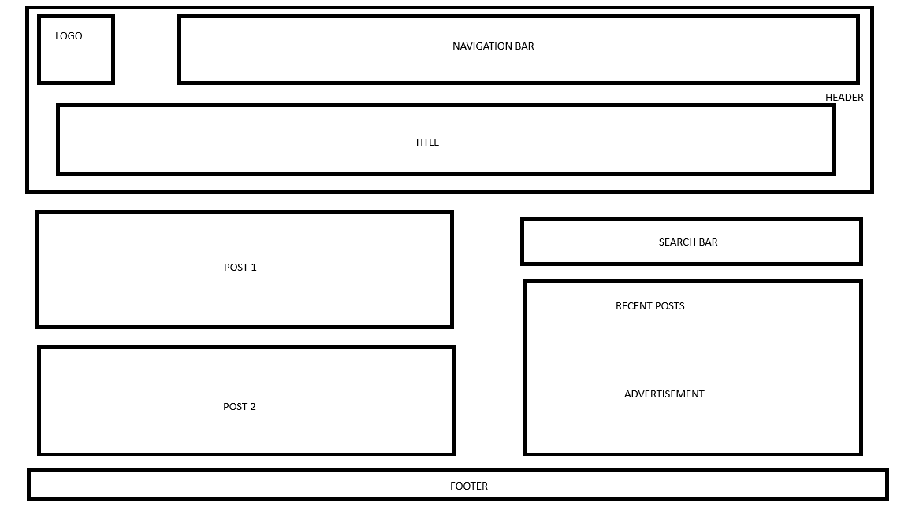

# Ван Вьет Бач - М3304

Page design:

# ITMO-Web-Frontend | Гаджиев Саид M3304

Шаблон сайта:

## Лабораторная работа №1

### Описание

Данная лабораторная работа направлена на создание макета сайта без использования CSS, только с помощью HTML. В рамках работы необходимо разработать сайт-резюме или портфолио. Основная цель — изучить ключевые HTML-теги и научиться правильно их использовать. Варианты тем включают: портфолио с галереей, интернет-магазин, гостевая книга, блог и другие.

### Задачи

1. **Подготовка среды разработки**:
   - Установить текстовый редактор или специализированное ПО (например, WebStorm).

2. **Определение темы и создание макета**:
   - Выбрать тему проекта.
   - Нарисовать схематичный макет сайта с указанием расположения изображений, текста и контактных форм.
   - Сохранить изображение макета в репозиторий (можно использовать фотографию рисунка на бумаге).

3. **Начальная настройка страницы**:
   - Установить кодировку страницы в UTF-8.
   - Описать ключевые слова и описание страницы в метаинформации.
   - При желании подключить файл стилей `outlines.css` для упрощения проектирования.

4. **Создание структуры сайта**:
   - Добавить Doctype.
   - Использовать теги `<html>`, `<head>`, `<body>`.
   - Установить язык сайта на русский.
   - Добавить заголовок страницы.
   - Убедиться, что в `README.md` указаны ваше ФИО и номер группы, а также тема проекта.

5. **Логическая структура**:
   - Использовать теги `<main>`, `<header>`, `<footer>`.
   - Применять теги `<section>`, `<nav>`, `<article>`, `<aside>`, `<h1>`-`<h6>`, `
` по назначению.
   - Использовать теги для списков (`<ul>`, `<ol>`) для описания ваших достижений или неудач.
   - Вставить блок с псевдографикой из символов ASCII.
   - Вставить snippet кода, оформив его соответствующими тегами.
   - Добавить цитату и формулу успеха, используя теги `` и ``.
   - Для выделения важных моментов использовать теги `<strong>`, `<b>`, `<em>`, `<i>`, `<del>`, `<ins>`.

---

## Лабораторная работа №2

### Описание

Цель второй лабораторной работы — научиться создавать и применять стили к элементам HTML. Основное внимание уделяется созданию визуально завершённых и приятных глазу элементов, которые, однако, гармонируют между собой и не создают излишней пестроты. Рекомендуется использовать сервисы для подбора цветовых сочетаний перед началом работы, например, [Adobe Color](https://color.adobe.com/ru/).

### Задачи

1. **Создание и подключение стилей**:
   - Создать собственный файл стилей и подключить его к странице, разработанной в рамках первой лабораторной работы.

2. **Стилизация элементов**:
   - Применить стили ко всем элементам на странице, включая границы, отступы и шрифты.

3. **Использование различных селекторов**:
   - Использовать различные типы CSS-селекторов, предпочтительно следуя конкретной методологии (например, БЭМ).

4. **Добавление изображений**:
   - Вставить на страницу изображения, которые соответствуют выбранной стилистике.

5. **Определение цветов и теней**:
   - Задать цвета фона и теней для элементов, чтобы они выглядели согласованно и привлекательно.

6. **Применение текстовых стилей**:
   - Настроить стили для текста, включающие:
     1. Размер шрифта.
     2. Высоту строки.
     3. Семейство используемых шрифтов.
     4. Насыщенность шрифта.
     5. Выравнивание текста (горизонтальное и вертикальное).
     6. Цвет фона и текста.
     7. Отступы и пробелы.
     8. Стилизацию переформатированного текста.
     9. Подчеркивание, зачеркивание и другие текстовые эффекты.
     10. Регистр символов.
    
---

## Лабораторная работа №3

### Описание

В третьей лабораторной работе необходимо произвести выравнивание всех ранее созданных элементов сайта. Для этого можно использовать гибкие способы верстки, такие как Flexbox или Floats, либо применить 12-колоночную сетку. Важно наличие горизонтальных и вертикальных рядов элементов. В случае отсутствия таких элементов можно добавить, например, галерею с изображениями.

Дополнительно требуется адаптировать макет под различные размеры экранов (маленький ноутбук, Full HD, 2K монитор), а также выбрать элементы, которые не будут отображаться на маленьких мониторах.

### Задачи

1. **Выравнивание элементов**:
   - Выравнивание всех элементов сайта, используя Flexbox, Floats или 12-колоночную сетку.
   - Обеспечить наличие горизонтальных и вертикальных рядов элементов.

2. **Адаптация под различные экраны**:
   - Проработать внешний вид макета на различных мониторах.
   - Скрыть элементы, не умещающиеся в клиентскую область, используя CSS-правила `@media screen`.

3. **Закрепление элементов**:
   - Закрепить элемент с помощью абсолютного позиционирования. Например, это может быть строка меню, шапка или подвал сайта.

4. **Создание таблицы**:
   - Добавить на страницу таблицу с заголовками и стилями для четных и нечетных строк.
   - Использовать Grid для таблицы, чтобы колонки изменяли свой размер в зависимости от размера окна.

---

## Лабораторная работа №4

### Описание

Целью четвёртой лабораторной работы является освоение взаимодействия с элементами и браузером при помощи встроенного скриптового движка JavaScript. В рамках работы необходимо расширить функциональность сайта, добавив новые страницы и реализовав динамическое поведение элементов.

### Задачи

1. **Добавление новых страниц**:
   - Создать новые страницы для вашего проекта в соответствии с пунктами меню в шапке сайта.
   - Обеспечить корректную навигацию между страницами.

2. **Создание и подключение скрипта**:
   - Разработать JavaScript-скрипт, который будет выполняться на каждой странице сайта.
   - Разместить скрипт в отдельной папке проекта и подключить его в разделе `<head>` на всех страницах.

3. **Отслеживание загрузки страницы**:
   - Использовать IIFE (Immediately Invoked Function Expression) для подписки на событие загрузки страницы.
   - Вывести в подвале сайта статистическую информацию о скорости загрузки страницы.

4. **Интерактивность меню**:
   - Добавить интерактивность в меню сайта, используя события наведения мыши. Реализовать это можно при помощи CSS или JavaScript.

5. **Обработка активного пункта меню**:
   - В зависимости от того, на какой странице находится пользователь (определяется через `document.location`), добавить соответствующему пункту меню CSS-класс, отвечающий за его «активное» состояние.

---

## Лабораторная работа №5

### Описание

Целью пятой лабораторной работы является приобретение практических навыков по созданию динамической разметки во время выполнения (in runtime). В рамках работы необходимо разработать страницу с веб-формой, позволяющей пользователю генерировать таблицы по заданным параметрам, например, расписание занятий на неделю.

### Задачи

1. **Создание новой страницы и скрипта**:
   - Разработать отдельную страницу для конструктора таблиц и создать отдельный файл со скриптом для её функционала.
   - Добавить ссылку на новую страницу в меню навигации.

2. **Разработка формы и контейнера для результатов**:
   - Добавить элемент `<form>` на новую страницу для ввода параметров таблицы.
   - Создать контейнер `
`, в котором будут отображаться результаты генерации таблицы.

3. **Обработка события отправки формы**:
   - Реализовать перехват события `onSubmit` формы.
   - Без перезагрузки страницы сгенерировать и отобразить таблицу на основе введённых пользователем данных.

4. **Работа с локальным хранилищем**:
   - Предусмотреть возможность сохранения и загрузки введённых пользователем параметров в локальное хранилище браузера (LocalStorage).
   - Обеспечить восстановление параметров при перезагрузке страницы.

5. **Стилизация элементов**:
   - Для стилизации элементов использовать только заранее определённые классы из файла со стилями.
   - Избегать использования атрибутов `style` внутри HTML.

---

## Лабораторная работа №6

### Описание

Цель шестой лабораторной работы — познакомиться с сущностью `Promise`, научиться создавать HTTP-запросы и корректно обрабатывать ответы. В рамках данной работы студентам предлагается интегрировать "живые" данные в уже имеющийся проект, используя сервисы с Mock данными, например, JSONPlaceholder.

### Задачи

1. **Выбор данных для интеграции**:
   - Определиться с частью проекта, в которую будут загружаться данные. Это может быть профиль пользователя, комментарии, список дел, альбомы с фотографиями и т.д.
   - Использовать один из шести видов ресурсов, предоставляемых сервисом JSONPlaceholder:
     - Сообщения для гостевой книги/форума.
     - Комментарии под фото или другим материалом.
     - Альбомы и фотографии.
     - Список дел.
     - Пользователи.

2. **Создание скрипта для HTTP-запросов**:
   - Разработать отдельный скрипт и подключить его на страницу, где предполагается сетевое взаимодействие.
   - Настроить скрипт для выполнения HTTP-запросов с использованием Fetch API.

3. **Добавление анимации загрузки**:
   - Создать preloader в виде gif-анимации или css-анимации.
   - Разместить preloader под элементом, где будет отображаться загружаемый контент.

4. **Обработка данных**:
   - Дождаться события загрузки страницы и инициировать обращение к поставщику данных.
   - После получения ответа скрыть preloader, десериализовать данные в JSON-объект и отобразить их на странице.

5. **Фильтрация данных**:
   - Реализовать псевдослучайную фильтрацию данных (например, при первом запросе получать элементы с ID 100 и выше, а при втором — с ID 200 и меньше).

6. **Обработка ошибок**:
   - Добавить обработку ошибок (например, при отсутствии сети или неудачном запросе).
   - В случае возникновения ошибки, отобразить под элементом сообщение об ошибке, например, «⚠ Что-то пошло не так».

---

## Лабораторная работа №7

### Описание

Цель седьмой лабораторной работы — изучение продвинутых практик взаимодействия с DOM и CSS с использованием подключаемых JavaScript библиотек. В этой лабораторной работе студенты должны продемонстрировать умение работать со сторонними API популярных библиотек и интегрировать их в свой проект.

### Задачи

1. **Выбор UI библиотек**:
   - Изучите предложенный список библиотек: [Awesome JavaScript](https://github.com/sorrycc/awesome-javascript).
   - Выберите одну или две UI библиотеки, которые можно интегрировать в ваш проект. Например:
     - Модальное окно + Toster
     - Слайдер для вашей галереи (например, [Swiper](https://swiperjs.com/demos/130-centered/core.html))

2. **Реализация сценария использования**:
   - Опишите сценарий использования выбранных библиотек.
   - Реализуйте этот сценарий в вашем проекте, интегрируя функционал библиотек в соответствии с описанным use-case.

3. **Документация кода**:
   - Добавьте комментарии в ваш JavaScript код перед вызовами сторонних библиотек.
   - Укажите, какой аргумент функции используется, для чего он предназначен и как вы конфигурируете ту или иную часть библиотеки.

4. **Стилизация компонентов**:
   - Настройте стили для подключенных компонентов, чтобы они гармонично вписывались в уже использованную цветовую палитру вашего проекта.
   - Убедитесь, что подключенные элементы не выбиваются из общего стиля сайта.

### Рекомендации

- Лабораторная работа имеет творческий характер. Для получения наилучших результатов старайтесь использовать возможности выбранных библиотек в полном объеме.
- Избегайте чрезмерного подключения больших фреймворков ради одного элемента. Выбирайте библиотеки, которые действительно улучшают функциональность вашего проекта.